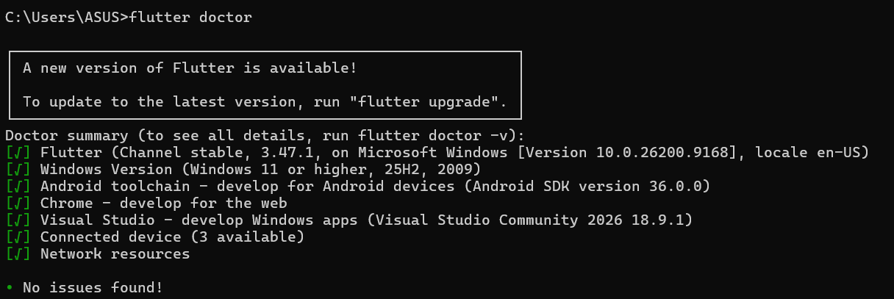
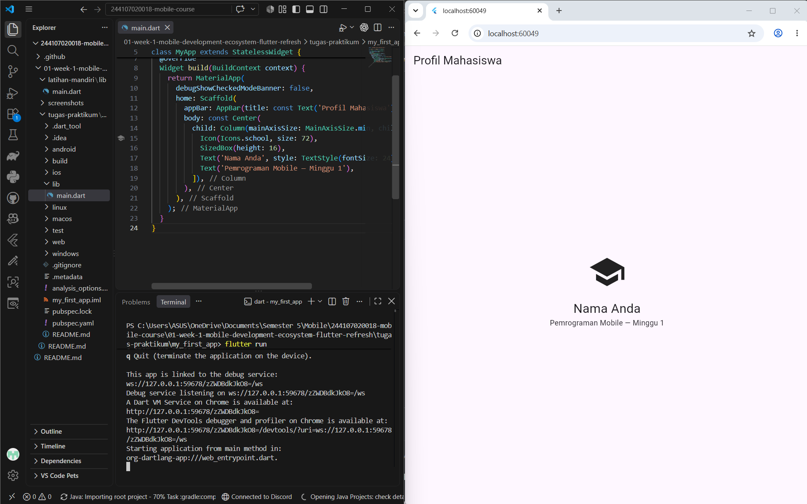
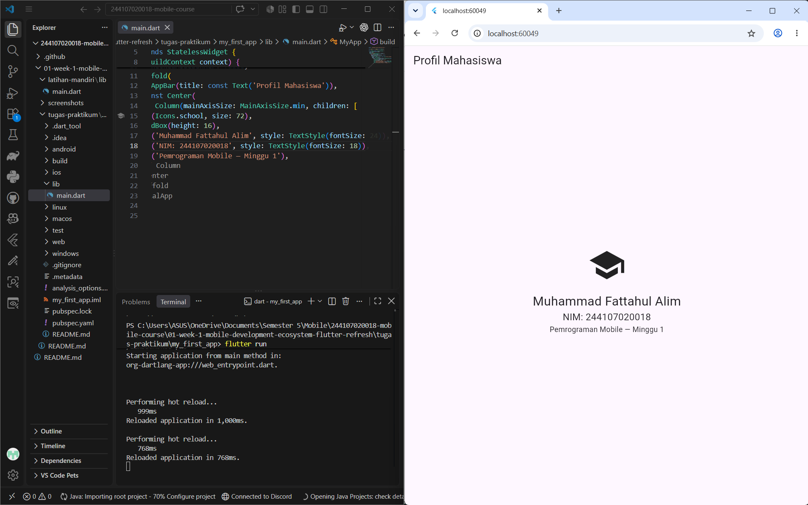
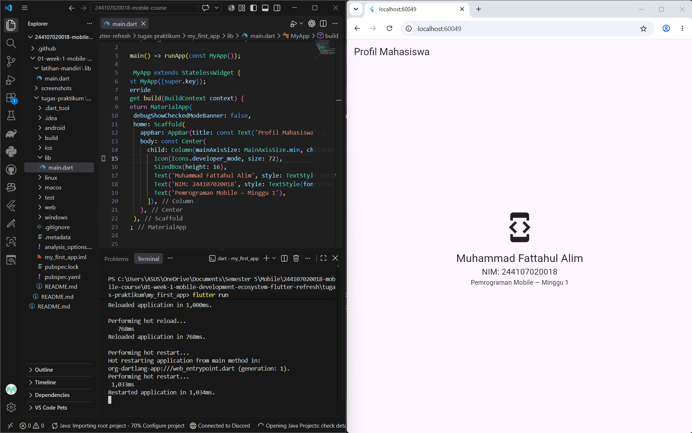
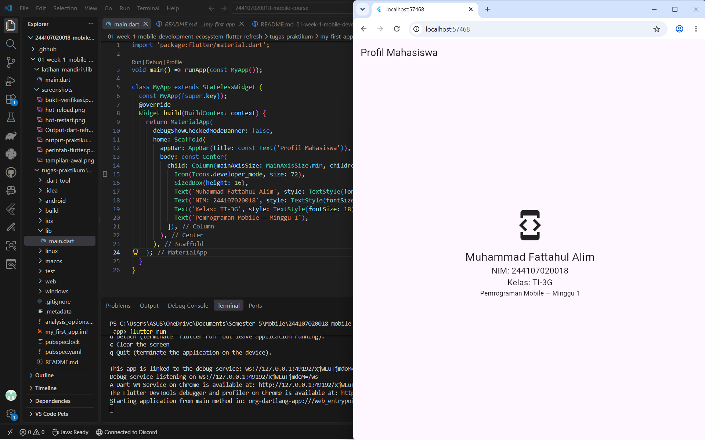

# WEEK 1

## Tujuan Pembelajaran
- mempelajari evolusi pengembangan mobile serta perbedaan native, hybrid, dan cross-platform;
- memahaim arsitektur Flutter, peran Dart, struktur proyek, dan widget tree;
- mengulang dasar Dart: variabel, tipe data, fungsi, class, dan null safety;
- menyiapkan Flutter, Android SDK, emulator atau perangkat fisik, lalu menjalankan aplikasi pertama;
- mengubah UI awal Flutter dan menyimpan hasilnya pada repository Git pribadi.

## Fitur utama
- Tampilan atau UI untuk halaman profil mahasiswa

## Stack teknologi
- Bahasa Pemrograman: Dart
- Framework Pengembangan Aplikasi: Flutter
- Lingkungan Pengembangan (IDE): Visual Studio Code
- Target Platform / Lingkungan Uji Coba: Web Browser
- Sistem Kontrol Versi: Git (untuk penyimpanan repository pribadi)

## Cara Menjalankan
1. Persiapan Lingkungan: Pastikan laptop Anda sudah terinstal Git, Flutter SDK (dengan path yang ditambahkan ke Environment Variables), dan browser Chrome atau Android Studio sebagai target perangkat. Selain itu, siapkan juga IDE Visual Studio Code yang telah dipasangi ekstensi Flutter dan Dart.
2. Buka Terminal, PowerShell, atau Command Prompt pada direkotori yang anda inginkan dan jalankan perintah di bawah:
``` 

```
3. Masuk ke direktori repository yang baru saja diunduh:
```
cd 244107020018-mobile-course/01-week-1-mobile-development-ecosystem-flutter-refresh
```
4. Arahkan secara spesifik ke direktori tempat proyek Flutter berada. Berdasarkan struktur path, masuk ke folder aplikasi:
```
cd tugas-praktikum/my_first_app
```
5. Unduh semua dependensi atau library yang dibutuhkan oleh aplikasi:
```
flutter pub get
```
6. Buka folder proyek (my_first_app) di VS Code.
7. Buka terminal bawaan VS Code (Ctrl + `).
8. Jalankan perintah kompilasi:
```
flutter run
```
9. Jika terdapat lebih dari satu perangkat yang terdeteksi, terminal akan meminta Anda memilih target (contoh: [1] Windows, [2] Chrome, [3] Edge).
10. Ketik angka yang merujuk pada browser Chrome
11. Tunggu proses build selesai. Halaman profil akan otomatis terbuka di browser anda

## Hasil yang dicapai 
1. Pemahaman Dasar Bahasa Dart: Mengimplementasikan bahasa pemrograman dart pada latihan mandiri dengan membuat fungsi logika matematika (luas persegi panjang), fungsi profil, dan memanggilnya di dalam fungsi main sehingga dapat menampilkan output yang diharapkan.
2. Environment setup: Lingkungan untuk pengembangan pemrograman mobile telah dikonfigurasi sehingga dapat dijalankan dengan baik. Konfigurasi sendiri meliputi instalasi Flutter SDK, integrasi dengan IDE (VS Code), dan penyiapan target perangkat (seperti Google Chrome atau emulator).

    Bukti verifikasi: 
    


3. Modifikasi Antarmuka (UI): Berhasil menjalankan emulator serta memodifikasi tampilan antarmuka antarmuka bawaan (default) menjadi halaman "Profil Mahasiswa"

    Tampilan Awal: 
    

    Perubahan text + hot reload :
    

    Perubahan icon + hot restart :
    

## Mini Assignment
``` 
Buat aplikasi Profil Mahasiswa berdasarkan praktikum. Tambahkan NIM dan satu informasi tambahan menggunakan widget dasar. Push hasil ke repository portfolio sesuai struktur yang ditentukan. Sertakan screenshot dan penjelasan singkat atas satu kendala setup yang Anda temui.
```

Direktori praktikum terdapat pada tugas-praktikum, sementara kode main.dart untuk praktikum sendiri terletak pada direktori my_first_app/lib/main/dart

Hasil: 


## Kendala setup
Kendala terjadi saat flutter doctor mencari android license, awalnya icon berupa tanda seru untuk memberikan peringatan bahwa android license tidak temukan. Setelah saya install tools dan cek flutter doctor terjadi perbedaan versi sehingga android license tidak ditemukan sehingga saya harus download tools dengan versi yang sesuai agar dapat environment setup dapat berjalan sesuai yang diinginkan

## Refleksi 

### 1. Kapan native lebih tepat dipilih daripada cross-platform?
Native lebih tepat dipilih ketika aplikasi membutuhkan performa tinggi, akses yang kompleks dan mendalam ke sebuah perangkat keras spesifik (Bluetooth tingkat lanjut, sensor khusus, kamera dengan pemrosesan kompleks). Native juga cocok jika pengalaman pengguna harus sangat mengikuti standar dan karakteristik masing-masing platform.
### 2. Bagaimana perubahan state berhubungan dengan widget tree dan UI deklaratif?
Dalam ui deklaratif seperti flutter state (data/kondisi) sangat menentukan bagaimana ui seharusnya berada. Ketika state berubah, Flutter akan membangun ulang pada widget yang berkaitan dengan state tersebut. Framework kemudian menghitung perbedaan antara widget tree lama dan baru, lalu hanya memperbarui bagian antarmuka yang benar-benar mengalami perubahan secara efisien.
### 3. Mengapa commit kecil dengan pesan jelas bermanfaat bagi pekerjaan tim dan portfolio?
Commit kecil dengan pesan yang jelas membuat perubahan kode lebih mudah dilacak, dipahami, dan diperiksa oleh anggota tim. Jika terjadi kesalahan, perubahan tertentu juga lebih mudah ditemukan atau dibatalkan tanpa memengaruhi banyak bagian kode. Sementara Untuk portfolio, commit yang rapi menunjukkan bahwa developer memiliki kebiasaan kerja yang terstruktur dan profesional, serta memahami penggunaan Git dalam pengembangan perangkat lunak. Riwayat commit yang jelas juga dapat membantu orang lain memahami perkembangan sebuah proyek.


