# WEEK 3

## Tujuan Pembelajaran
- menjelaskan konsep navigasi, route, dan perbedaan Navigator 1.0 dengan GoRouter;
- menerapkan navigasi multi-page dengan GoRouter, termasuk passing argument dan deep link sederhana;
-  menjelaskan mengapa state management diperlukan dan cara kerja Riverpod (Provider, ConsumerWidget, Notifier);
- menggunakan AsyncValue untuk menangani state loading, error, dan success pada UI;
- membangun aplikasi ToDo dengan navigasi dan Riverpod, lalu memverifikasi hasilnya dengan widget test sederhana.

## Fitur Utama
- Navigasi beberapa halaman menggunakan GoRouter dengan NavigationBar sebagai navigasi utama
- State Management terpusat menggunakan riverpod
- Manajemen data ToDo yang reaktif terhadap perubahan State
- Filter data tugas

## Hasil yang dicapai
- Aplikasi ToDo berjalan dengan navigasi yang mengarahkan antara halaman todo dengan statistik

| Halaman ToDo | Halaman Statistik|
|:---:|:---:|
|     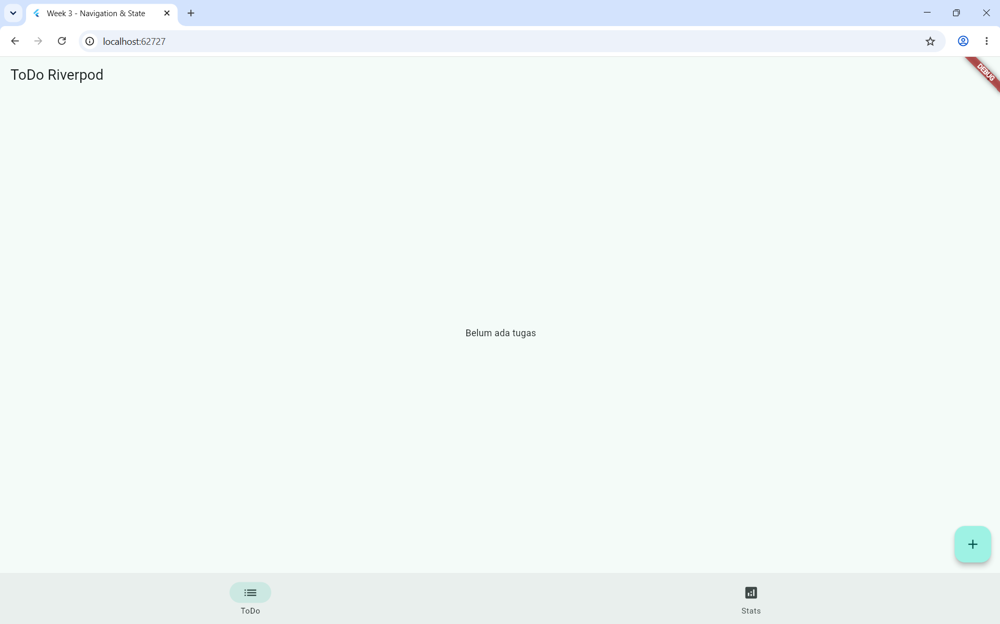   |  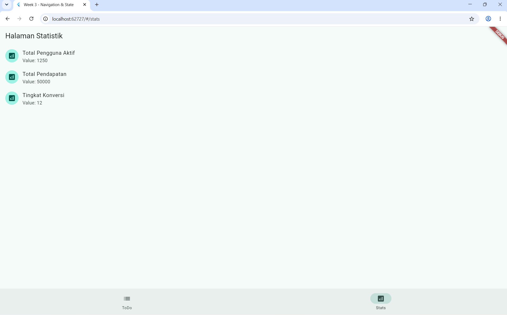 |

- Penambahan tombol aksi untuk menandai selesai, dan menghapus tugas berfungsi dan langsung terlihat di UI

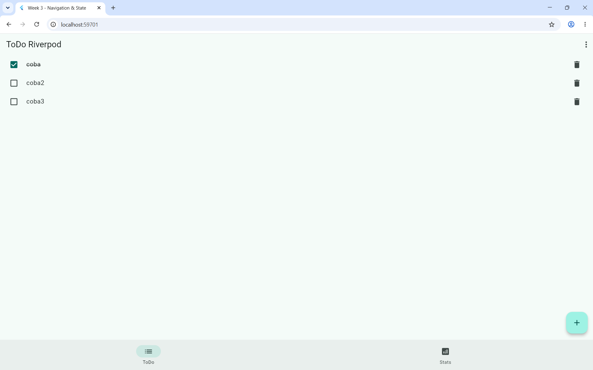 

- Filter tugas berhasil memisahkan tampilan berdasarkan status selesai dan belum selesai

| Default | Filter Selesai| Filter Belum Selesai|
|:---:|:---:|:---:|
|     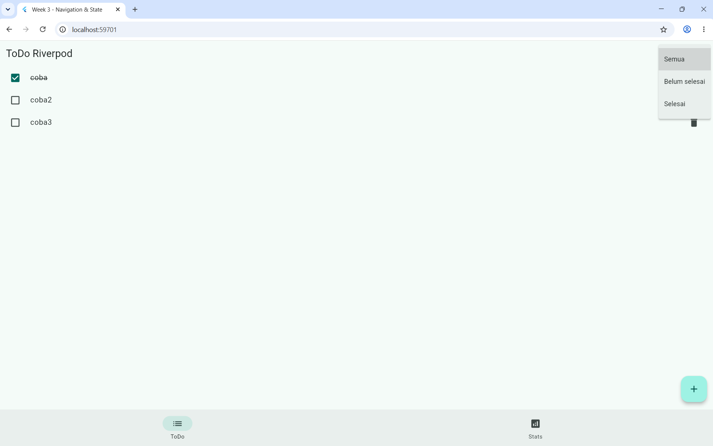   |  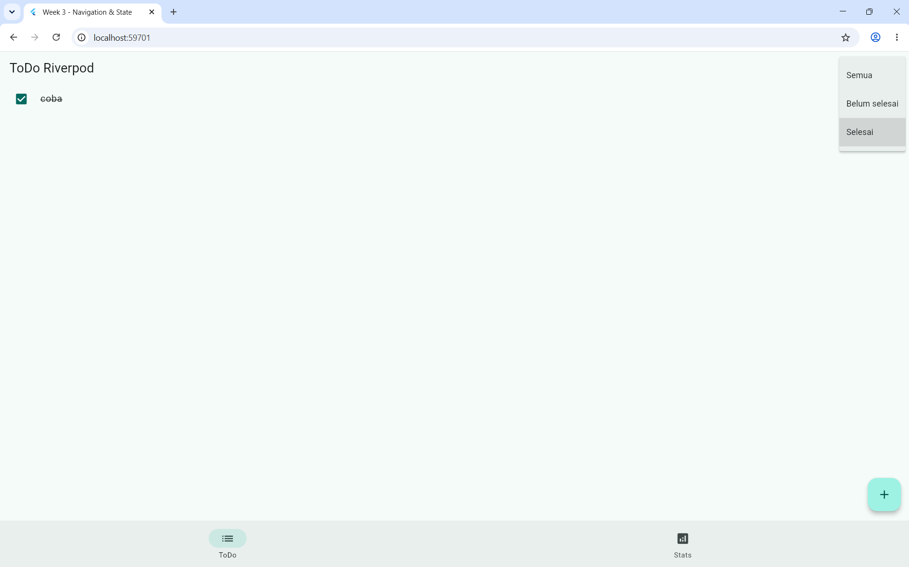 | 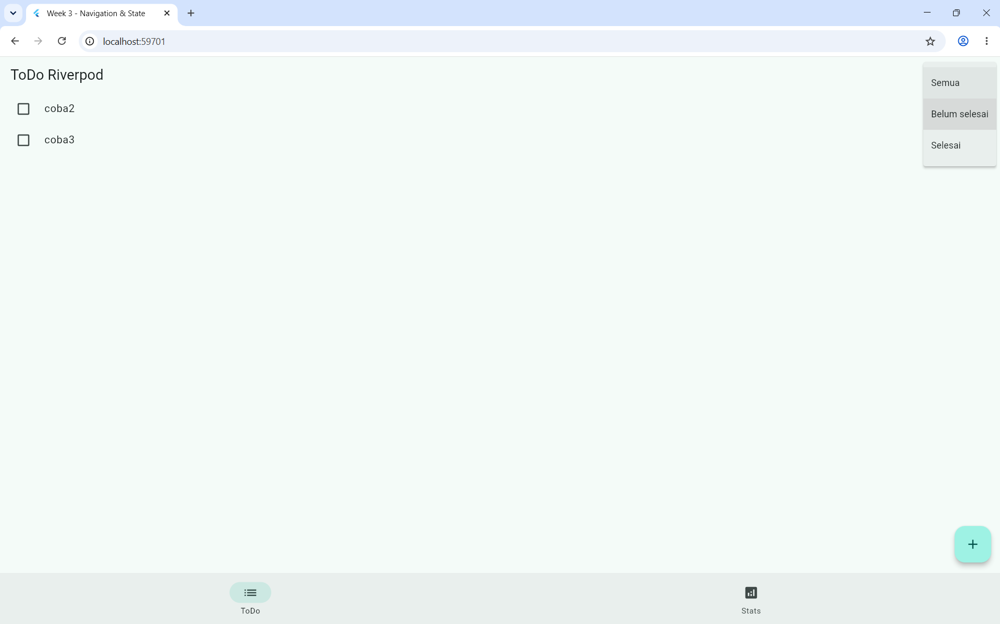 |

## AI PROMPT CHALLENGE
Prompt:
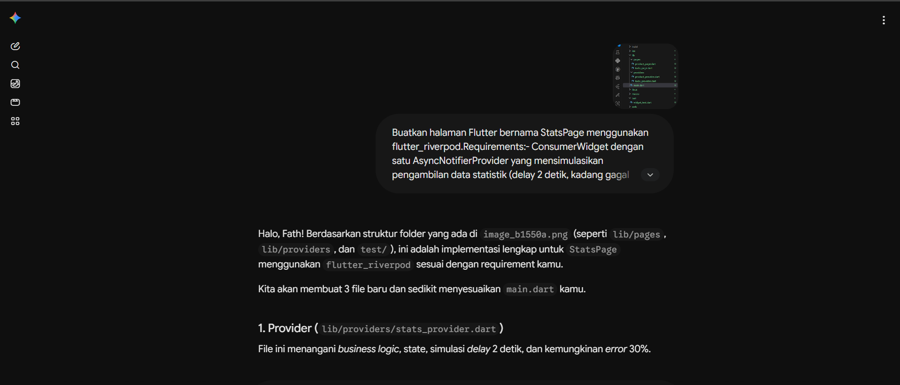 

Hasil :
| Skenario Berhasil | Skenario Gagal|
|:---:|:---:|
|     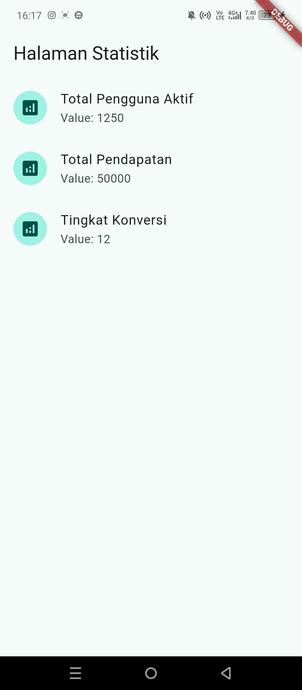   |  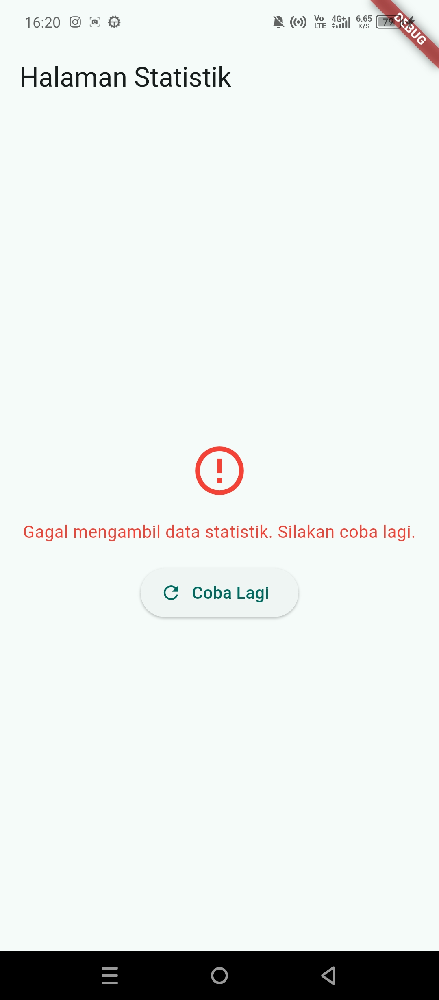|

#### AI Verification Checklist

#### 1. Apakah state diubah secara immutable (tidak ada state.add() atau mutasi list langsung)?
Ya. immutable state digunakan sehingga state list tidak pernah dimodifikasi secara langsung seperti melalu state.add(). Penggunaan immutable state sendiri adalah dengan membuat instane list menggunakan spread operator atau fungsi list seperti where().toList() saat memperbarui nilai state

#### 2. Apakah ref.watch hanya dipakai di dalam build, dan ref.read di callback?
Ya. ref.watch() hanya dipanggil di dalam fungsi build() pada TodoPage agar widget dapat merespons perubahan secara otomatis. Sementara itu, ref.read() hanya dipanggil di dalam fungsi callback seperti onPressed untuk mengeksekusi aksi/method pada notifier tanpa memicu rebuild widget.

#### 3. Apakah ketiga state AsyncValue benar-benar ditangani (bukan hanya success)?
Pada StatsPage, ketiga state AsyncValue (loading, error, dan data) sudah ditangani secara lengkap menggunakan method .when()

#### 4. Apakah ketiga state AsyncValue benar-benar ditangani (bukan hanya success)?
Ya. Semua provider (seperti todoListProvider, todoFilterProvider, dan filteredTodosProvider) dideklarasikan secara eksplisit dengan tipe data yang jelas (misalnya NotifierProvider<TodoListNotifier, List< ToDo>) dan masing-masing memiliki nama unik tanpa ada duplikasi nama variabel

#### 5. Apakah kode AI memakai API Riverpod versi lama?

Tidak. ode yang digunakan sudah sepenuhnya bersih dari pola usang. kode tidak menggunakan StateNotifierProvider atau StateProvider model lama yang dianggap antipattern, melainkan sudah murni menggunakan Notifier dan NotifierProvider modern standar Riverpod, serta menggunakan ConsumerWidget bersih tanpa nested Consumer yang tidak perlu.

#### Jalankan flutter analyze dan flutter test, apakah hasil AI lolos tanpa warning?

Flutter analyze:
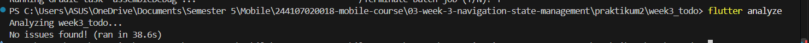

Flutter Test:
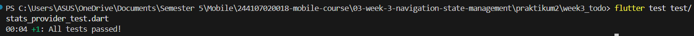

## Refleksi

#### 1. Kapan setState masih cukup, dan kapan state harus naik ke Riverpod?

setState cukup ketika state yang dikelola bersifat lokal, hanya berdampak pada satu widget itu sendiri. Sementara state yang harus naik ke riverpod ketika data atau state tersebut perlu dibagikan (shared) ke banyak halaman/widget berbeda, perlu bertahan saat navigasi berpindah, atau melibatkan logika business logic dan proses asynchronous (seperti mengambil data dari API, database lokal, atau otentikasi).

#### 2. Apa perbedaan context.go dan context.push, dan kapan masing-masing tepat digunakan?

- context.go melakukan penggantian stack navigasi secara menyeluruh
- context.push menumpuk (push) halaman baru di atas halaman yang sedang aktif dengan tetap mempertahankan tombol back

#### 3. Bagaimana AsyncValue mencegah bug dibanding tiga boolean terpisah?

Menggunakan tiga boolean terpisah sering memunculkan invalid state combinations seperti kondisi di mana isLoading bernilai true tetapi hasError juga true secara bersamaan karena lupa di-reset oleh programmer. AsyncValue mencegah bug ini dengan membungkus state ke dalam bentuk mutually exclusive states yang jelas sehingga UI dipaksa untuk menangani kondisi tersebut secara terstruktur dan aman.

#### 4. Bagian mana dari hasil AI yang Anda perbaiki, dan mengapa?

Bagian yang diperbaiki adalah penerapan indeks pada fungsi toggle dan remove di dalam daftar todo yang sudah difilter. karena jika menggunakan indeks urutan list mentah, saat daftar todo difilter indeks angka tersebut akan berbeda dari posisi aslinya di todoListProvider, contoh jika ada tugas masak (index 0) dan belanja (index 1), yang sudah dikerjakan tugas belanja lalu filter ke tugas selesai, maka tugas yang akan tampil adalah tugas belanja saja dan indexnya berubah jadi 0, jika kita hapus nantinya yang terhapus adalah tugas masak yang index nya 0. Maka dari itu diperbaiki dengan mengubah pendekatannya menjadi berbasis referensi objek Todo langsung (object reference), sehingga fungsi hapus dan centang tetap akurat meskipun data sedang difilter.