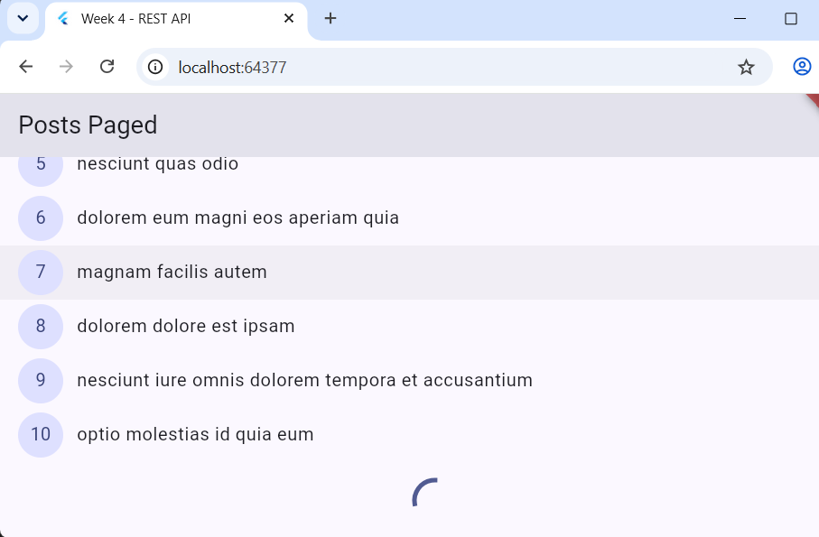
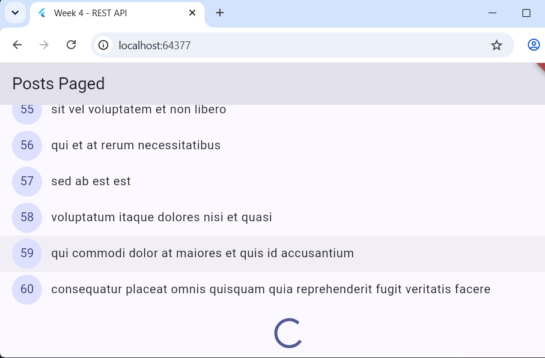
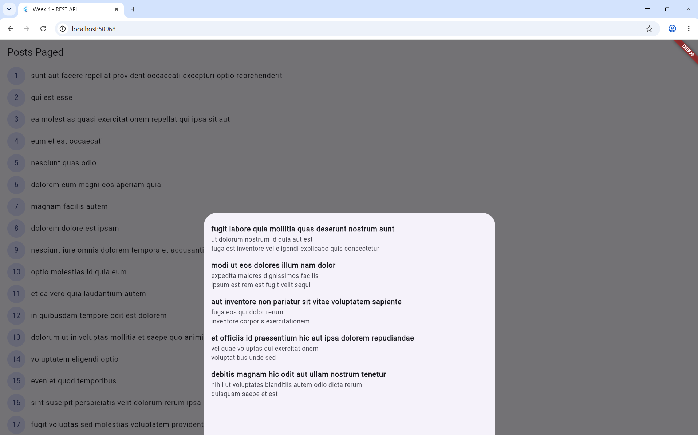
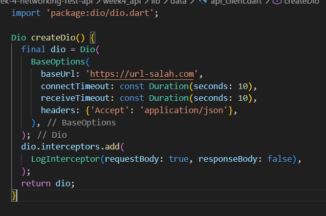
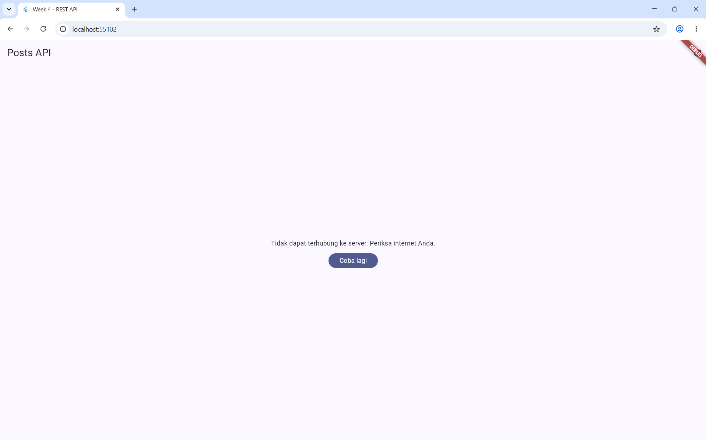
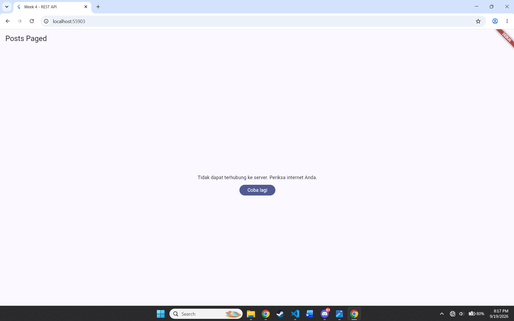
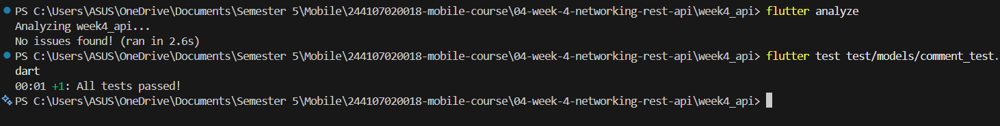
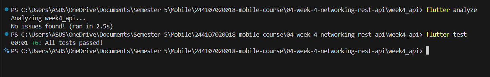
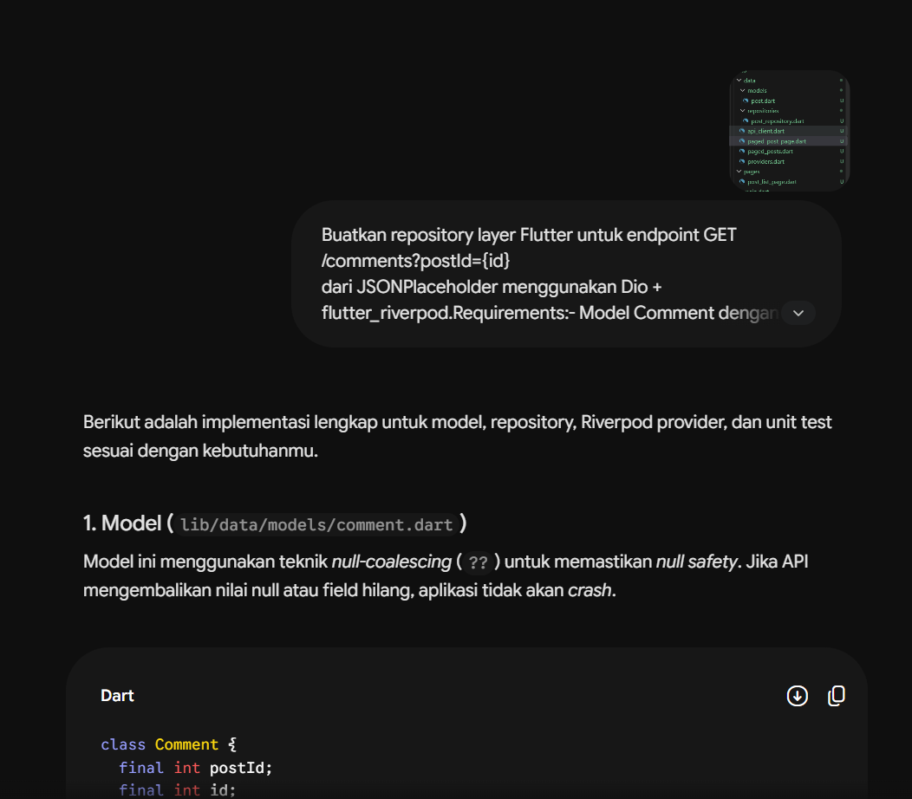

# Week 4

## Tujuan Pembelajaran 
1. menjelaskan konsep HTTP, REST API, dan JSON;
2. memetakan JSON ke model Dart (serialization) dengan aman null;
3. menerapkan repository pattern dasar sehingga UI tidak memanggil API secara langsung;
4. mengonfigurasi Dio (base URL, timeout, interceptor) dan menangani error jaringan;
5. menampilkan state loading, error, empty, dan success pada UI dengan AsyncValue + Riverpod;
6. menerapkan pagination dasar (infinite scroll).


## Fitur Utama
1. Integrasi REST API: Mengambil data postingan dari API publik JSONPlaceholder (`/posts`) menggunakan Dio sebagai HTTP client
2. Model & Serialization Aman Null: Konversi JSON ke model Dart (`fromJson`) dengan null-safety agar aplikasi tidak crash saat data tidak lengkap
3. Repository Pattern: Pemisahan logic pengambilan data dari UI, sehingga widget hanya berkomunikasi dengan repository, bukan langsung ke API
4. Dio Terpusat: Konfigurasi base URL, timeout, dan interceptor logging dalam satu instance Dio yang dapat digunakan ulang di seluruh aplikasi
5. State Management dengan Riverpod + AsyncValue: Menampilkan 4 kondisi UI secara eksplisit (loading, error dengan tombol retry, empty, dan success)
6. Pagination / Infinite Scroll: Memuat data 10 item per halaman secara otomatis saat pengguna scroll ke bawah, dilengkapi guard untuk mencegah request ganda
7. Detail Postingan: Menampilkan detail lengkap sebuah post melalui dialog/modal saat item pada list ditekan
8. Unit & Provider Testing: Pengujian pada model/error mapping serta provider menggunakan repository palsu (fake repository)


## Cara Menjalankan
1. Persiapan Lingkungan: Pastikan laptop Anda sudah terinstal Git, Flutter SDK (dengan path yang ditambahkan ke Environment Variables), dan browser Chrome atau Android Studio sebagai target perangkat. Selain itu, siapkan juga IDE Visual Studio Code yang telah dipasangi ekstensi Flutter dan Dart.
2. Buka Terminal, PowerShell, atau Command Prompt pada direktori yang Anda inginkan dan jalankan perintah di bawah:
```
git clone https://github.com/FattahulAlim/244107020018-mobile-course.git
```
3. Masuk ke direktori repository yang baru saja diunduh:
```
cd 244107020018-mobile-course/04-week-4-networking-rest-api
```
4. Arahkan secara spesifik ke direktori tempat proyek Flutter berada. Berdasarkan struktur path, masuk ke folder aplikasi contoh:
```
cd week4_api
```
5. Unduh semua dependensi atau library yang dibutuhkan oleh aplikasi:
```
flutter pub get
```
6. Buka folder proyek (responsive_dashboard) di VS Code.
7. Buka terminal bawaan VS Code (Ctrl + `).
8. Jalankan perintah kompilasi:
```
flutter run
```
9. Jika terdapat lebih dari satu perangkat yang terdeteksi, terminal akan meminta Anda memilih target (contoh: [1] Windows, [2] Chrome, [3] Edge).
10. Ketik angka yang merujuk pada browser Chrome
11. Tunggu proses build selesai. Halaman profil akan otomatis terbuka di browser anda


## Hasil yang Dicapai

### 1. Menampilkan Data dari API dengan Pagination (Infinite Scroll)
Aplikasi berhasil menampilkan daftar postingan dari API secara bertahap, 10 item per halaman, dan otomatis memuat data berikutnya saat pengguna scroll ke bawah tanpa terjadi duplikasi atau request ganda.

| 10 item pertama | 10 item ke-n |
|:---:|:---:|
|||

### 2. Menampilkan Detail Postingan
Saat item pada daftar di-klik, aplikasi menampilkan detail postingan terkait dalam bentuk modal, yang menampilkan informasi tambahan dari data yang diambil.



### 3. Penanganan 4 State UI
Aplikasi berhasil menangani dan menampilkan seluruh state (loading, error dengan tombol retry, empty, dan success) sesuai kondisi data yang diterima dari API.

| cek dengan url salah | hasil url salah |
|:---:|:---:|
|||

Mencoba dengan mematikan sinyal internet:


### 4. Pengujian Berhasil Lulus
Minimal 2 test (unit test model/error mapping dan test provider dengan fake repository) berhasil dijalankan dan lulus tanpa error.

| Hasil Pengujian Test Model | Hasil Pengujian dengan fake repository|
|:---:|:---:|
|||

## AI Prompt Challenge

### Prompt :
```
Buatkan repository layer Flutter untuk endpoint GET /comments?postId={id}
dari JSONPlaceholder menggunakan Dio + flutter_riverpod.
Requirements:
- Model Comment dengan fromJson aman null (postId, id, name, email, body).
- CommentRepository dengan method fetchComments(postId) + timeout 10 detik.
- AsyncNotifierProvider dengan penanganan error otomatis (AsyncError)
  dan fungsi pesan error
  ramah pengguna untuk timeout, connection error, 404, dan 500.
- Satu unit test untuk fromJson dengan field yang hilang.
Jelaskan setiap bagian kode dalam komentar.
```

### Proses Prompting:


### Hasil (Modals untuk menampilkan detail item)


### AI Verification Checklist
## Evaluasi Kode

**1. Apakah UI memanggil Dio secara langsung?**

Tidak. UI (`PagedCommentSheet`) hanya memanggil `ref.watch(commentsProvider(postId))`. Provider kemudian meneruskan permintaan ke `CommentRepository`, dan hanya repository ini yang berinteraksi langsung dengan `Dio`. Dengan begitu, pemisahan antar layer tetap terjaga.

**2. Apakah `fromJson` aman null?**

Ya. Proses parsing menggunakan safe casting, contohnya `(json['id'] as num?)?.toInt() ?? 0` dan `json['name'] as String? ?? ''`. Dengan cara ini, aplikasi tidak akan crash meskipun API mengembalikan nilai null atau ada key yang hilang.

**3. Apakah semua tipe `DioExceptionType` dipetakan ke pesan pengguna?**

Ya. Fungsi `friendlyErrorMessage` di `providers.dart` sudah menangani berbagai jenis error dari Dio, yaitu `connectionTimeout`, `sendTimeout`, `receiveTimeout`, `connectionError`, dan `badResponse` (seperti error 404 dan 500). Semua jenis error ini diubah menjadi pesan yang mudah dipahami dalam Bahasa Indonesia.

**4. Apakah `baseUrl`/timeout sudah terpusat?**

Ya. `CommentRepository` menggunakan fungsi `createDio()` dari `api_client.dart` sebagai sumber konfigurasi. Sehingga `baseUrl` dan timeout (10 detik) hanya diatur di satu tempat, tidak tersebar di berbagai method.

**5. Apakah test menguji kasus field hilang?**

Ya. Unit test `incompleteJson` sengaja menghilangkan key `id`, `email`, dan `body`, serta membuat `name` bernilai null. Hasil test membuktikan model tetap berhasil dibuat dengan nilai default, tanpa error.

**6 Jalankan flutter analyze dan flutter test**


## Refleksi & Pemahaman Konsep

**1. Mengapa UI dilarang memanggil Dio langsung? Apa yang rusak jika dilanggar?**

UI dilarang memanggil Dio langsung karena itu melanggar pemisahan tanggung jawab. Kalau widget langsung memanggil Dio, maka:
- UI jadi tahu detail teknis jaringan (URL, header, format response) padahal seharusny hanya menampilkan data.
- Kalau sumber data berubah (misal API diganti, atau ditambah caching), banyak file UI lain yang terpengaruh dan harus dibetulkan.
- Testing jadi sulit, karena untuk menguji UI harus melakukan request ke API (cepat atau lambatnya tergantung dengan koneksi internet).
- Kalau ada beberapa widget yang butuh data sama, logic fetching bisa ke-duplikasi di banyak tempat, dan sering menyebabkan tidak konsisten antara file satu dengan yang lain (Misalnya lupa mengubah suatu file sehingga file itu error padahal yang lain tidak).

**2. Kapan pagination client-side cukup, dan kapan harus pakai pagination server (`_page`/`_limit`)?**

- Client-side: Cukup menggunakan client-side saja jika jumlah data kecil dan API tidak mendukung parameter pagination. Semua data diambil sekaligus, lalu ditampilkan bertahap di UI, tapi datanya sudah lengkap di memori.
- Paginatiion server: Menggynakan pagination server jika data besar atau terus bertambah, karena kalau semua diambil sekaligus akan boros memor dan menyebabkan lambat saat load pertama sehingga membebani server. Dengan `_page`/`_limit`, server hanya mengirim sebagian data sesuai kebutuhan, dan client tinggal minta halaman berikutnya saat user scroll.

**3. Bagaimana exception di repository bisa berubah jadi `AsyncError` tanpa try/catch di tiap widget? Kapan try/catch eksplisit tetap dibutuhkan?**

Ini karena `AsyncValue` (dari Riverpod) sudah otomatis menangkap error yang terjadi di dalam `Future` yang dipantau oleh provider. Jadi kalau repository melempar `DioException`, dan provider memanggil repository itu di dalam `FutureProvider` atau `AsyncNotifier`, Riverpod otomatis membungkus hasilnya jadi `AsyncData`, `AsyncLoading`, atau `AsyncError` — tanpa kita perlu menulis try/catch manual di widget. UI tinggal cek state-nya menggunakan `.when(data: ..., error: ..., loading: ...)`.

Try/catch eksplisit tetap dibutuhkan saat:
- butuh menangani error dengan cara khusus di tengah proses (misalnya retry otomatis, atau ubah jadi nilai default alih-alih error).
- Ada logic tambahan yang harus dijalankan saat error terjadi, seperti logging manual atau mengirim event analytics.
- memanggil fungsi async di luar konteks provider (misalnya di dalam `onPressed` langsung), yang tidak otomatis ditangkap oleh `AsyncValue`.

**4. Bagian mana dari hasil AI yang diperbaiki, dan mengapa?**

Salah satu yang diperbaiki adalah bagian null-safety di `Comment.fromJson`. Versi awal dari AI hanya aman terhadap field yang hilang atau bernilai null (pakai `as num?` dan `as String?` dengan fallback `??`), tapi ternyata masih bisa error kalau tipe datanya salah — misalnya field `id` dikirim sebagai `String` padahal seharusnya angka. Ini ditemukan lewat penambahan edge case test sendiri.

Perbaikannya adalah menambahkan helper `_parseInt` dan `_parseString` yang mengecek tipe data terlebih dahulu sebelum melakukan konversi, sehingga tetap aman meskipun API mengirim tipe data yang tidak konsisten.
