# Offline Notes — Week 5: Local Storage & Offline-First

# Identitas
| Field  | Isi           |
|--------|---------------|
| Nama   | Muhammad Fattahul Alim   |
| NIM    | 244107020018   |
| Kelas  | TI            |
| Absen  | 15|
## Tujuan pembelajaran

- menjelaskan perbedaan penyimpanan key-value (SharedPreferences), relasional (SQLite/sqflite), dan NoSQL (Hive) di perangkat;
- menyimpan preferensi sederhana (tema gelap/terang, waktu terakhir dibuka) dengan SharedPreferences;
- menerapkan CRUD catatan dengan SQLite (sqflite) melalui repository lokal (`NoteRepository`);
- menerapkan pola offline-first: cache-first read (untuk data `Post` dari API), dirty flag, dan antrean sinkronisasi (`syncNotes`);
- menampilkan state loading, error, empty, dan success untuk data lokal dengan Riverpod (`AsyncNotifier`, `FutureProvider`);
- menguji repository lokal dengan repository palsu (`FakeNoteRepository`) tanpa database sungguhan.

## Fitur utama

1. **CRUD catatan** — tambah dan hapus catatan, tersimpan permanen di SQLite lokal, daftar terurut berdasarkan `updated_at` terbaru.
2. **Preferensi** — toggle mode gelap/terang dan pencatatan waktu terakhir aplikasi dibuka, tersimpan via SharedPreferences.
3. **Offline-first untuk data tulis** — setiap catatan baru ditandai `dirty = true`, dan tombol sync mengunggah (simulasi) lalu menandainya bersih via `syncNotes()`.
4. **Cache-first untuk data baca** — data `Post` dari API ditampilkan dari cache lokal terlebih dahulu, lalu diperbarui di background tanpa memblokir UI.
5. **Halaman detail catatan** — diakses via rute `/note/:id` (GoRouter), membaca langsung dari repository lokal berdasarkan ID, bukan dari state halaman daftar.
6. **Pengujian otomatis** — repository lokal diuji dengan repository palsu (fake), tanpa bergantung pada database sungguhan.

## Tech stack

- **Flutter** — UI framework
- **Riverpod** (`flutter_riverpod`) — state management, termasuk `AsyncNotifierProvider` dan `FutureProvider`
- **sqflite** — penyimpanan relasional lokal untuk catatan (`notes`) dan cache posts (`cached_posts`)
- **SharedPreferences** — penyimpanan key-value untuk preferensi (dark mode, waktu terakhir dibuka)
- **Dio** — HTTP client untuk fetch data `Post` dari JSONPlaceholder API
- **GoRouter** — navigasi deklaratif, termasuk rute dinamis `/note/:id`
- **flutter_test** — unit test model dan provider


## Cara Menjalankan
1. Persiapan Lingkungan: Pastikan laptop Anda sudah terinstal Git, Flutter SDK (dengan path yang ditambahkan ke Environment Variables), dan browser Chrome atau Android Studio sebagai target perangkat. Selain itu, siapkan juga IDE Visual Studio Code yang telah dipasangi ekstensi Flutter dan Dart.
2. Buka Terminal, PowerShell, atau Command Prompt pada direktori yang Anda inginkan dan jalankan perintah di bawah:
```
git clone https://github.com/FattahulAlim/244107020018-mobile-course.git
```
3. Masuk ke direktori repository yang baru saja diunduh:
```
cd 244107020018-mobile-course/05-week-5-local-storage-offline-first
```
4. Arahkan secara spesifik ke direktori tempat proyek Flutter berada. Berdasarkan struktur path, masuk ke folder aplikasi contoh:
```
cd week5_offline_notes
```
5. Unduh semua dependensi atau library yang dibutuhkan oleh aplikasi:
```
flutter pub get
```
6. Buka folder proyek (responsive_dashboard) di VS Code.
7. Buka terminal bawaan VS Code (Ctrl + `).
8. Jalankan perintah kompilasi:
```
flutter run
```
9. Jika terdapat lebih dari satu perangkat yang terdeteksi, terminal akan meminta Anda memilih target (contoh: [1] Windows, [2] Chrome, [3] Edge).
10. Ketik angka yang merujuk pada browser Chrome
11. Tunggu proses build selesai. Halaman profil akan otomatis terbuka di browser anda

## Hasil yang dicapai

- Aplikasi catatan offline-first yang berjalan tanpa koneksi internet untuk operasi tulis (create, delete), dengan status sinkronisasi yang terlihat jelas per catatan.
- Pola cache-first berhasil diverifikasi: data lama tetap tampil instan meski offline, lalu diperbarui otomatis di background begitu koneksi tersedia (dibuktikan lewat callback `onUpdated` + `ref.invalidateSelf()`).
- Preferensi (tema, waktu terakhir dibuka) persisten lintas sesi aplikasi, diverifikasi lewat pengujian full restart.
- Kode direfactor menjadi lebih modular: UI (`NoteTile`), logic sinkronisasi (`lib/data/sync.dart`), dan repository CRUD (`NoteRepository`) dipisah sesuai tanggung jawab masing-masing.
- Minimal 2 test lulus: 1 unit test model (`Note.fromMap`, serialisasi dirty flag) dan test provider menggunakan repository palsu (skenario sukses dan error), termasuk penanganan edge case auto-retry Riverpod 3.0 pada pengujian error.

## Demo Aplikasi
**Post Belum Load**
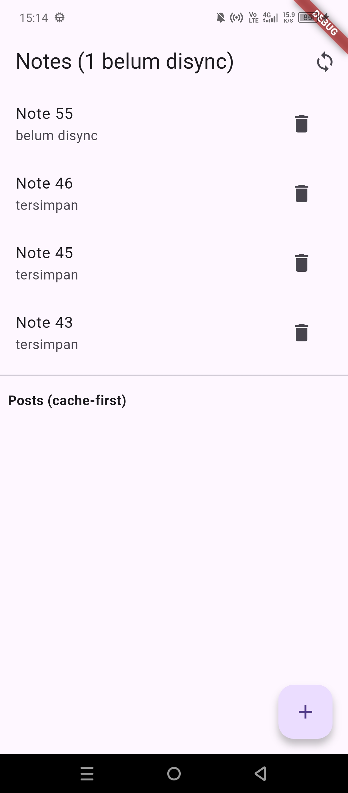
**Post Sudah Load**
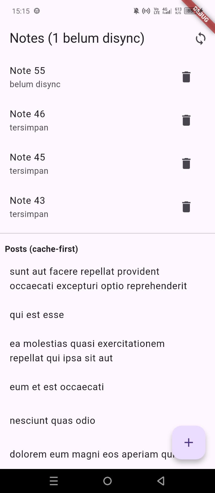
**Sebelum Tambah Data**
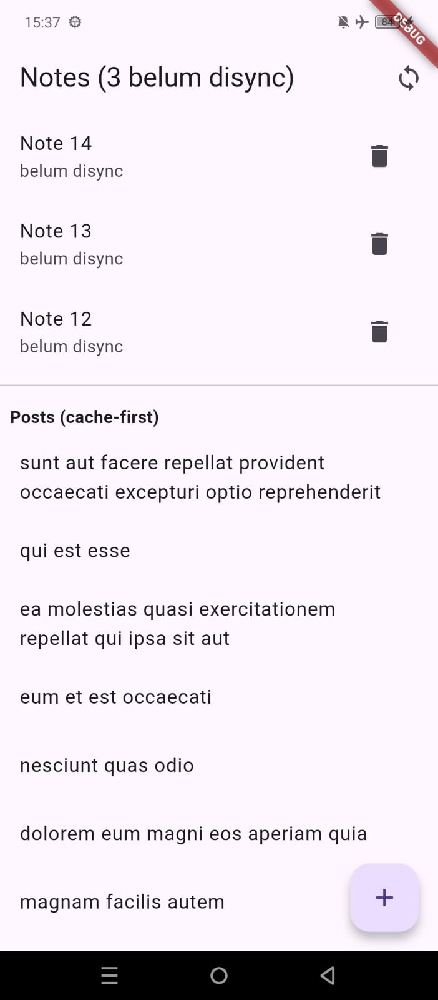
**Sesudah Tambah Data**
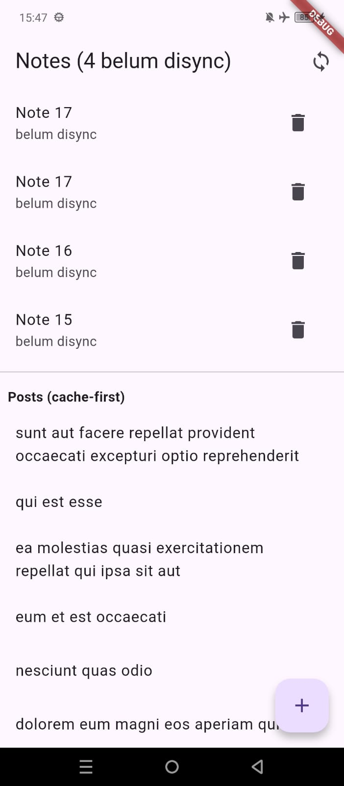
**Sebelum Sync Data**
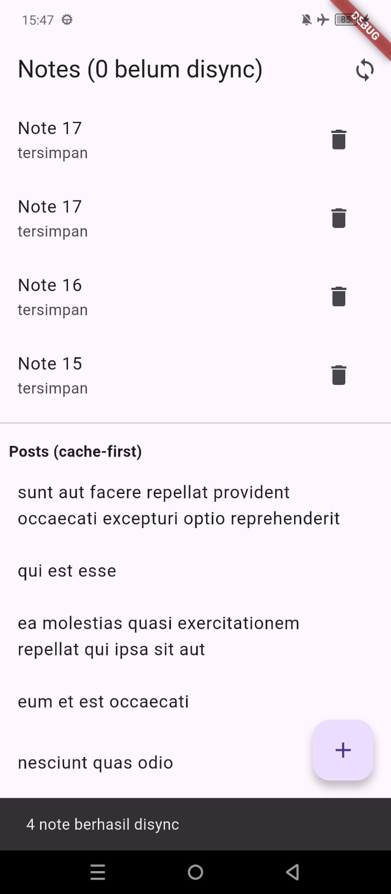
**Lihat Data Preference Saat Pertama Kali Dibuka**
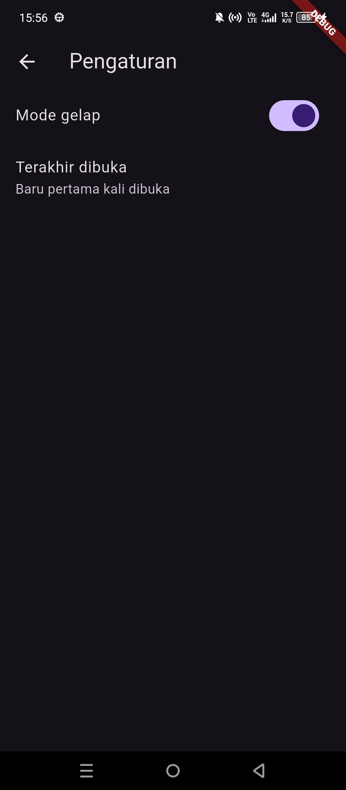
**Data Preference Saat Dibuka Lagi Setelah App Ditutup**

**Hasil Flutter Analyze dan Flutter Test**
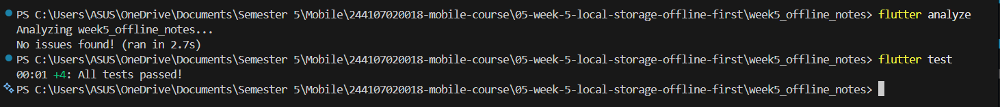

## AI Prompt Challenge

### Prompt:
```
Aplikasi Flutter Offline Notes: CRUD catatan + preferensi tema.
Bandingkan SharedPreferences, Hive, sqflite (SQLite), dan Drift
untuk dua kebutuhan ini. Requirements:
- Kriteria: kompleksitas query, kebutuhan relasi, reaktivitas (stream),
  type-safety, ukuran boilerplate, dan kemudahan testing.
- Beri rekomendasi final: mana untuk preferensi, mana untuk catatan,
  beserta alasannya dalam 1 tabel.
- Tunjukkan skema tabel/kotak untuk 1000+ catatan.
Jelaskan trade-off setiap pilihan.
```

### Hasil Prompt
|Bagian 1|Bagian 2|
|--|--|
|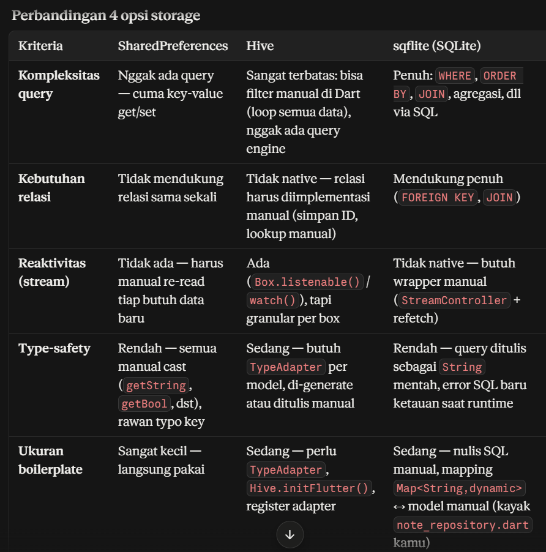|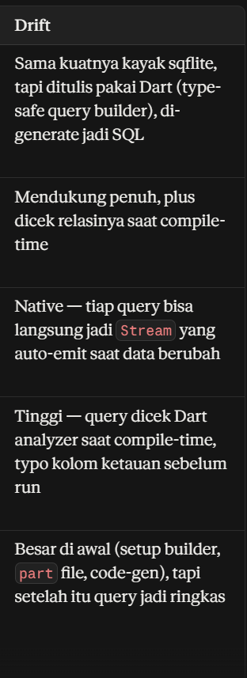|
|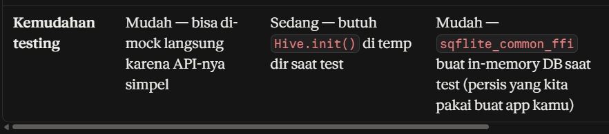|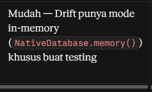|

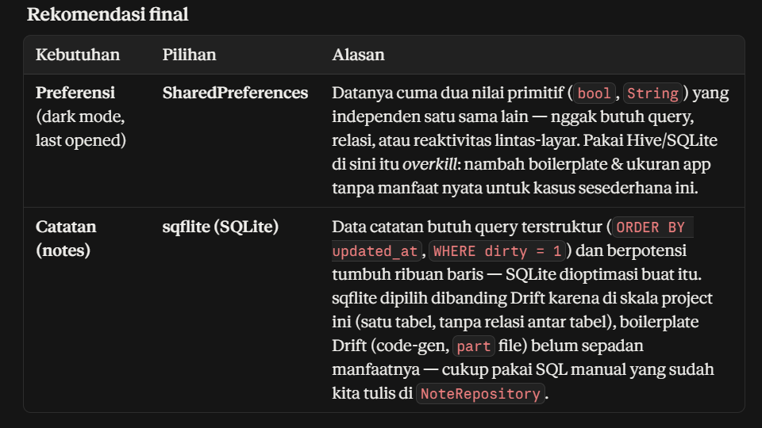
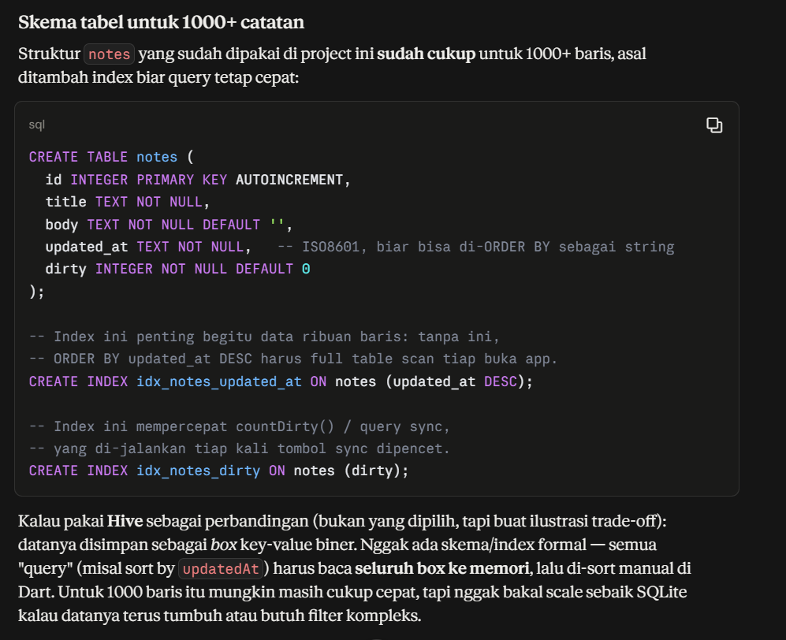
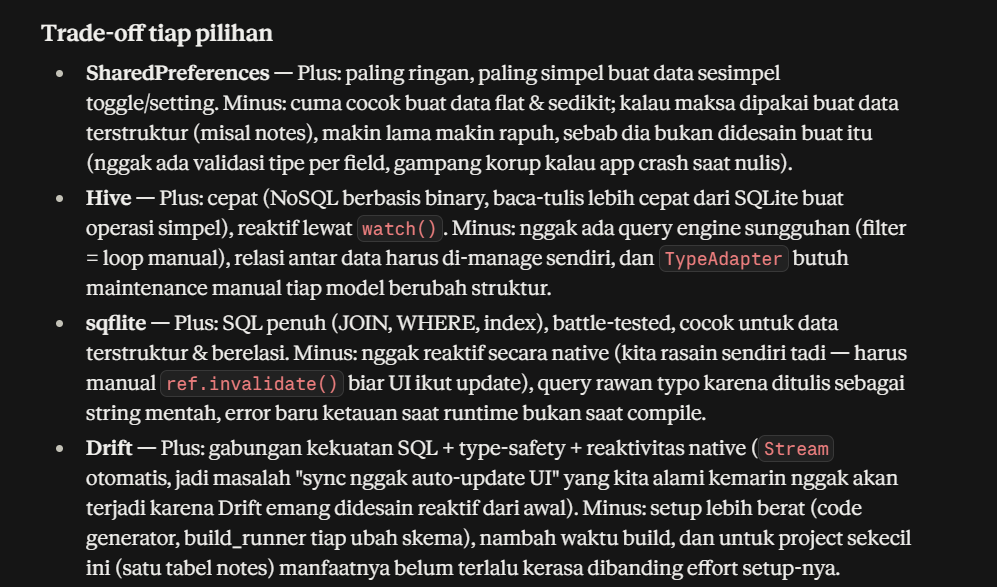

### AI Verification Challenge
1. **Apakah AI menempatkan daftar catatan di SharedPreferences? (menolak: rapuh untuk koleksi).**

Tidak. Rekomendasi AI memisahkan dua kebutuhan: SharedPreferences hanya untuk preferensi (dark mode, last opened) yang berupa nilai primitif tunggal, sedangkan daftar catatan diarahkan ke sqflite karena butuh query terstruktur dan berpotensi tumbuh ribuan baris. AI juga menjelaskan alasan penolakannya: SharedPreferences tidak punya validasi tipe per field dan rapuh untuk data terstruktur yang terus bertambah konsisten dengan implementasi project ini, di mana notes memang disimpan lewat sqflite (NoteRepository), bukan SharedPreferences.

2. **Apakah skema AI mendukung antrean sync (dirty flag / updated_at) atau hanya CRUD polos?**

Iya. Skema yang diberikan AI menyertakan kolom `dirty` dan `updated_at`, bukan cuma CRUD polos (`id`, `title`, `body`). AI bahkan menambahkan dua index terpisah: satu untuk `updated_at` DESC (agar sort list cepat) dan satu untuk dirty (agar query hitung antrean sync countDirty() cepat walau datanya ribuan baris). 

3. **Apakah klaim "real-time" AI didukung stream (Drift/watch) atau hanya asumsi?**

Ai tidak melakukan klaim bahwa reaktivitas sqflite tidak real-time namun butuh wrapper manual dan menyatakan bahwa fitur Stream reaktif secara native adalah keunggulan milik Drift.Ini juga sesuai dengan yang terjadi di project yaitu fitur auto-update UI setelah sync baru berjalan setelah `state = AsyncData(freshNotes)` ditambahkan manual di NotesNotifier bukan bawaan sqflite. Jadi real-time yang berjalan sekarang adalah hasil implementasi manual lewat Riverpod (`invalidateSelf`, set state langsung), sementara AI sendiri sudah benar menyebut Drift-lah yang punya Stream reaktif secara native, sqflite tidak.

4. **Apakah estimasi boilerplate AI masuk akal setelah Anda mencoba instalasinya (flutter pub add + migrasi skema)?**

Untuk sqflite masih masuk akal karena instalasi hanya menjalankan `flutter pub add sqflite path` tanpa code generator, dan migrasi skema cukup ditulis manual di `onCreate` (seperti `db.dart` yang sudah dibuat). Hal ini sesuai dengan klaim AI bahwa boilerplate-nya "sedang", bukan berat. Untuk SharedPreferences juga terbukti sangat ringan hanya perlu menjalankan `flutter pub add shared_preferences` sudah bisa digunakan tanpa setup tambahan, sesuai klaim "sangat kecil". Klaim boilerplate Drift belum dicoba langsung di project ini (karena keputusan akhirnya tidak pakai Drift), tapi berdasarkan pengalaman sqflite yang sudah relatif ringan, tambahan build_runner + part file di Drift akan membuatnya relatif lebih besar, walau angka pastinya belum diverifikasi lewat instalasi nyata.

5. **Keputusan final Anda beserta alasannya, boleh berbeda dari rekomendasi AI selama berargumen.**
Keputusan final: SharedPreferences untuk preferensi, sqflite (SQLite) untuk catatan sesuai rekomendasi AI, bukan Hive atau Drift. Alasannya kebutuhan preferensi di app ini cuma dua nilai primitif independen (bool dark mode, string timestamp), jadi SharedPreferences sudah cukup tanpa perlu overhead storage lain. Sementara catatan butuh query terurut (ORDER BY updated_at) dan filter untuk antrean sync (`WHERE dirty = 1`) yang berpotensi jalan di atas ribuan baris kebutuhan yang sesuai dengan kekuatan SQL sqflite. Drift memang unggul di reaktivitas native dan type-safety, tapi untuk skala project ini (satu tabel, tanpa relasi antar entity) overhead code-generator-nya belum sepadan dengan manfaatnya, terlebih solusi reaktivitas manual lewat Riverpod (`ref.invalidate` + `AsyncData`) sudah terbukti cukup. Hive juga tidak dipilih karena tidak native mendukung sorting/filtering berbasis kolom seperti `updated_at`/`dirty` tanpa memuat seluruh data ke memori terlebih dahulu.


## Refleksi

**1. Mengapa daftar catatan tidak boleh disimpan di SharedPreferences? Apa yang rusak jika aturan ini dilanggar?**

SharedPreferences dirancang untuk pasangan key-value primitif yang independen, bukan koleksi data terstruktur. Kalau daftar catatan dipaksa disimpan di sana (misal sebagai satu string JSON besar), setiap perubahan kecil seperti tambah, hapus, atau edit satu catatan mengharuskan seluruh koleksi dibaca, di-decode, diubah, di-encode ulang, lalu ditulis kembali secara utuh. Kalau ini dilanggar akan menyebabkan beberapa hal diantaranya:
* performa menurun drastis seiring jumlah catatan bertambah (operasi O(n) untuk setiap perubahan, bukan O(1) seperti query SQL by-id).
* risiko race condition meningkat kalau ada dua operasi tulis bersamaan, dan tidak ada mekanisme query mustahil melakukan `WHERE dirty = 1` atau `ORDER BY updated_at` tanpa memuat seluruh data ke memori dan memfilter manual. 
* Kegagalan penulisan di tengah proses (misal app crash) juga berisiko mengorupsi seluruh koleksi sekaligus, bukan hanya satu baris data.

**2. Kapan cache-first cukup, dan kapan Anda membutuhkan strategi lain (misalnya network-first untuk data harga real-time)?**

Cache-first cocok ketika perubahan data relatif jarang dan keterlambatan beberapa detik/menit tidak dipermasalahkan seperti data `Post` di aplikasi ini, artikel, atau konten yang sifatnya lebih statis. Prioritasnya adalah responsivitas sehingga pengguna langsung melihat sesuatu tanpa menunggu jaringan, walau datanya mungkin kurang update. Namun untuk data yang berubah cepat,keterlambatan pembaruan data dapat berakibat fatal misalnya harga saham, status stok barang terakhir, atau nilai tukar mata uang cache-first berisiko menampilkan informasi yang sudah tidak valid tanpa peringatan ke pengguna. Untuk kasus itu, dibutuhkan strategi **network-first** (coba fetch dulu, baru fallback ke cache kalau gagal/offline) atau bahkan **network-only** dengan indikator eksplisit "data mungkin kurang up-to-date" kalau terpaksa pakai cache.

**3. Bagaimana dirty flag berubah menjadi antrean sync tanpa memblokir UI? Kapan antrean terpisah (tabel outbox) menjadi perlu?**

Dirty flag adalah kolom status (`notes.dirty`) di tabel yang sama, bukan tabel terpisah. `addNote()` langsung sukses ke database lokal dan set `dirty = true`, tanpa menunggu jaringan. `syncNotes()` baru berjalan di akhir baca semua baris `dirty = 1`, kirim ke server (disimulasikan), lalu set dirty = 0. Karena dua proses ini terpisah dan async, UI tidak pernah terblokir.

Pendekatan ini cukup untuk kasus sederhana seperti project ini (hanya operasi create). Tabel outbox terpisah baru diperlukan kalau perlu melacak jenis operasi (create/update/delete) secara individual, retry berurutan (FIFO), riwayat percobaan gagal, atau satu entitas punya banyak perubahan tertunda sekaligus.

**4. Bagian mana dari rekomendasi AI yang Anda tolak, dan mengapa?**

Versi tanpa klaim soal masalah reaktivitas itu:

**4. Bagian mana dari rekomendasi AI yang Anda tolak, dan mengapa?**

Rekomendasi AI menyarankan Drift sebagai opsi yang lebih unggul dari sisi reaktivitas native (`Stream` otomatis) dan type-safety dibanding sqflite. Rekomendasi ini ditolak untuk project skala ini sehingga sqflite tetap dipilih untuk penyimpanan catatan. Alasannya: overhead setup Drift (code generator, `build_runner`, `part` file) tidak sepadan dengan manfaatnya untuk aplikasi dengan satu tabel utama tanpa relasi antar entitas. Kebutuhan reaktivitas UI di project ini sudah tercukupi lewat kombinasi `ref.invalidateSelf()` dan `state = AsyncData(...)` di Riverpod, sehingga trade-off besar Drift (dependency dan kompleksitas build process tambahan) belum sepadan, Drift baru benar-benar bernilai pada aplikasi dengan skema data lebih kompleks atau kebutuhan query lintas-tabel.