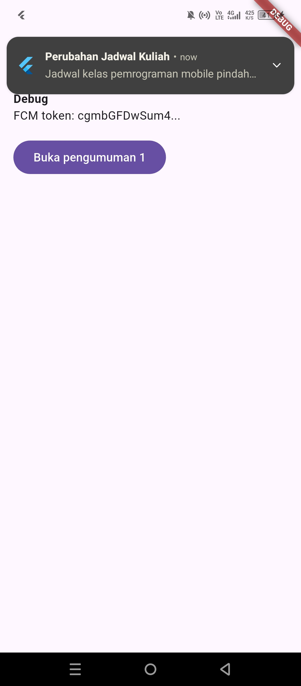
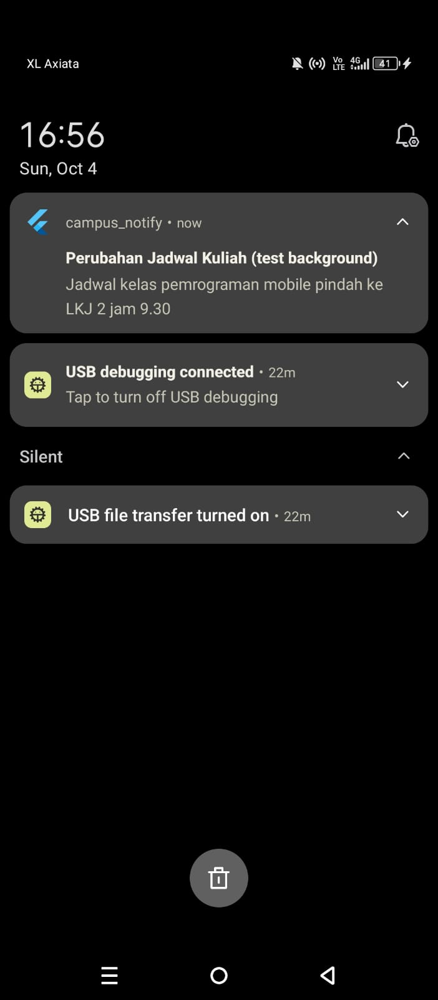
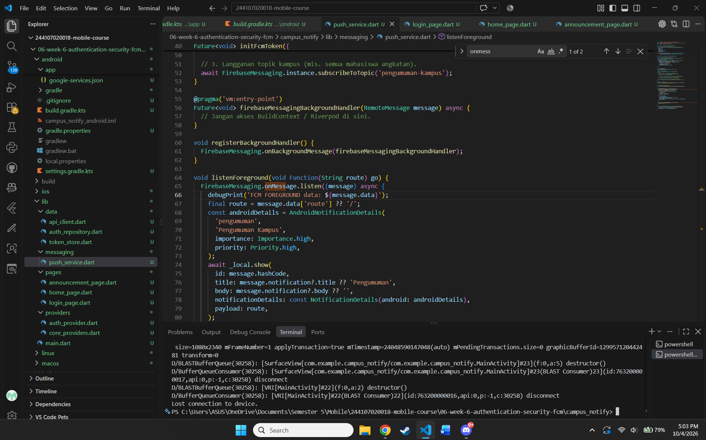
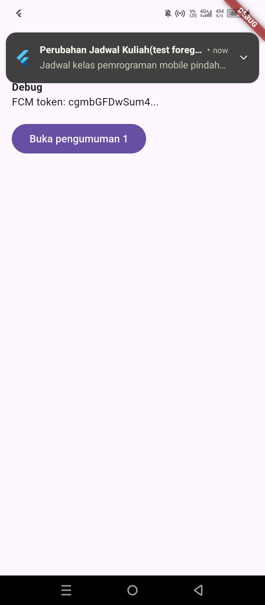
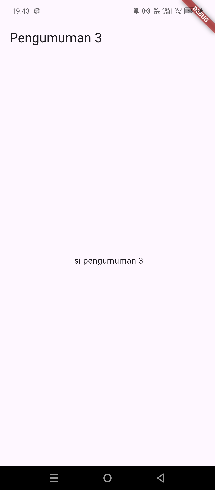
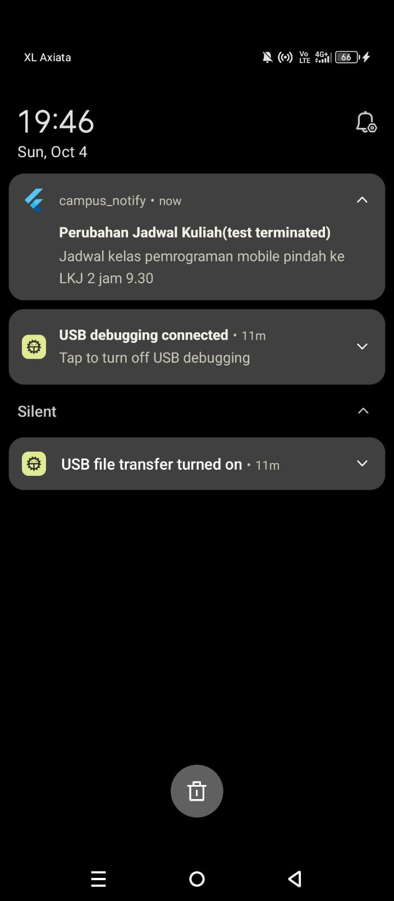
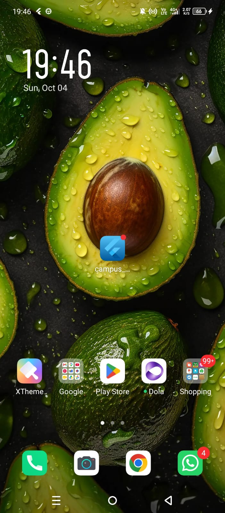
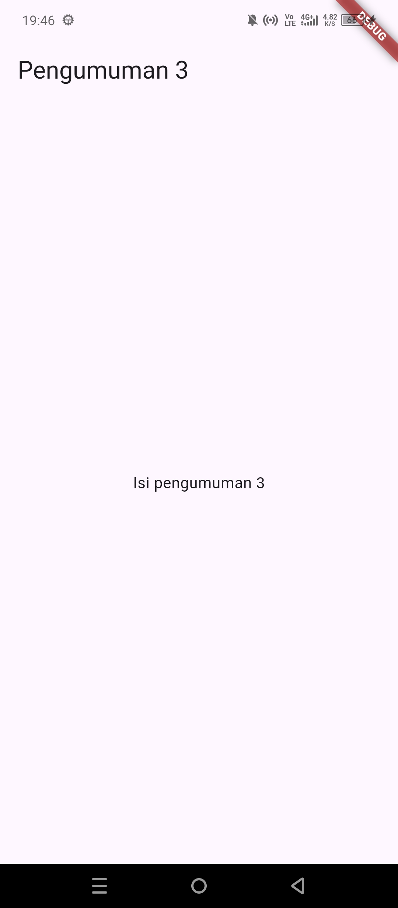

# Week 6 - Authentication, Security & FCM

# Identitas
| Field  | Isi           |
|--------|---------------|
| Nama   | Muhammad Fattahul Alim   |
| NIM    | 244107020018   |
| Kelas  | TI            |
| Absen  | 15|

## Tujuan pembelajaran

- menjelaskan alur autentikasi (Firebase Auth / JWT / OAuth / Google Login) dan perbedaan ID token vs access token vs refresh token;
- menyimpan token secara aman dengan secure storage (`flutter_secure_storage`) serta menerapkan token refresh otomatis lewat interceptor Dio;
- menjelaskan arsitektur FCM: app server, Firebase, dan perangkat;
- meminta notification permission dan mengelola token lifecycle (`getToken`, `onTokenRefresh`);
- membedakan notification payload vs data payload serta perilakunya pada state foreground, background, dan terminated;
- menangani klik notifikasi (deep link dengan GoRouter) dan topic messaging;
- menerapkan prinsip keamanan dasar aplikasi mobile (tidak menyimpan secret di kode, tidak log token).

## Fitur utama

1. **Autentikasi mock**: login dengan email dan kata sandi melalui `AuthRepository` (siap diganti Firebase Auth), status login dikelola `AuthNotifier` (Riverpod `AsyncNotifier`), dan rute dilindungi `redirect` GoRouter.
2. **Penyimpanan token aman**: access dan refresh token hanya keluar-masuk lewat `TokenStore` berbasis `flutter_secure_storage`.
3. **Refresh token otomatis**: interceptor Dio menambahkan header `Authorization`, mencoba refresh satu kali saat menerima 401, mengulang request, dan membersihkan sesi bila refresh gagal.
4. **Izin notifikasi dan token lifecycle**: meminta izin runtime (Android 13+), mengambil token FCM, memantau `onTokenRefresh`, dan mengirimnya ke backend dengan mekanisme coba ulang (`_pendingToken`). Token hanya ditampilkan terpotong di halaman Debug.
5. **Tiga state notifikasi**: foreground memakai local notification manual, background lewat `onMessageOpenedApp`, dan terminated lewat `getInitialMessage`, dengan background handler top-level (`@pragma('vm:entry-point')`).
6. **Deep link ke pengumuman**: klik notifikasi membuka `/pengumuman/:id` melalui `routeFromMessage` (fungsi murni dengan validasi rute) dan konstanta `AppRoutes`.
7. **Topic messaging**: berlangganan dan berhenti berlangganan topik `pengumuman-kampus` untuk broadcast.
8. **Pesan error ramah pengguna**: `friendlyMessage` memetakan `DioException` (401, timeout, offline) menjadi pesan yang aman ditampilkan di UI.
9. **Pengujian otomatis**: unit test untuk `routeFromMessage` dan `friendlyMessage` tanpa bergantung pada Firebase.


## Tech stack

- **Flutter** — UI framework
- **Riverpod** (`flutter_riverpod`) — state management, termasuk `AsyncNotifierProvider` untuk status autentikasi
- **Firebase Core** (`firebase_core`) — inisialisasi Firebase
- **Firebase Cloud Messaging** (`firebase_messaging`) — push notification, token, dan topic messaging
- **flutter_local_notifications** — banner notifikasi manual saat aplikasi di foreground
- **flutter_secure_storage** — penyimpanan access dan refresh token yang aman
- **Dio** — HTTP client dengan interceptor untuk header `Authorization` dan refresh token otomatis
- **GoRouter** — navigasi deklaratif, proteksi rute lewat `redirect`, dan deep link `/pengumuman/:id`
- **flutter_test** — unit test fungsi murni (`routeFromMessage`, `friendlyMessage`)

## Cara Menjalankan
1. Persiapan Lingkungan: Pastikan laptop Anda sudah terinstal Git, Flutter SDK (dengan path yang ditambahkan ke Environment Variables), dan browser Chrome atau Android Studio sebagai target perangkat. Selain itu, siapkan juga IDE Visual Studio Code yang telah dipasangi ekstensi Flutter dan Dart.
2. Buka Terminal, PowerShell, atau Command Prompt pada direktori yang Anda inginkan dan jalankan perintah di bawah:
```
git clone https://github.com/FattahulAlim/244107020018-mobile-course.git
```
3. Masuk ke direktori repository yang baru saja diunduh:
```
cd 244107020018-mobile-course/06-week-6-authentication-security-fcm
```
4. Arahkan secara spesifik ke direktori tempat proyek Flutter berada. Berdasarkan struktur path, masuk ke folder aplikasi contoh:
```
cd campus_notify
```
5. Unduh semua dependensi atau library yang dibutuhkan oleh aplikasi:
```
flutter pub get
```
6. Buka folder proyek (responsive_dashboard) di VS Code.
7. Buka terminal bawaan VS Code (Ctrl + `).
8. Jalankan perintah kompilasi:
```
flutter run
```
9. Jika terdapat lebih dari satu perangkat yang terdeteksi, terminal akan meminta Anda memilih target (contoh: [1] Windows, [2] Chrome, [3] Edge).
10. Ketik angka yang merujuk pada browser Chrome
11. Tunggu proses build selesai. Halaman profil akan otomatis terbuka di browser anda

## Hasil yang dicapai

- Alur login mock berjalan: pengguna diarahkan ke `/login` bila belum masuk dan ke beranda setelah berhasil masuk.
- Notifikasi dari Firebase Console berhasil diterima pada perangkat Android (Infinix X6815D) di ketiga state, dan klik banner membuka halaman **Pengumuman 3** dengan payload `route` = `/pengumuman/3`.

| State | Mekanisme | Rute diharapkan | Hasil | 
|---|---|---|---|
| Foreground | Local notification manual | `/pengumuman/3` | Lolos |
| Background | `onMessageOpenedApp` | `/pengumuman/3` | Lolos |
| Terminated | `getInitialMessage` | `/pengumuman/3` | Lolos |

**Bukti**
| Jenis Test | Screenshot | Redirect |
|---|---|---|
| Foreground |  | | 
| Background |||
| Terminated | | |

**Bukti tambahan bahwa memang aplikasi sudah terminated di vscode dengan jam**
|Foto|
|---|
||

- Token FCM tampil terpotong (12 karakter + `...`) di halaman Debug dan tidak pernah dicetak penuh.
- Kode hasil AI diaudit dan diperbaiki pada lima poin: urutan `init()`, token yang gagal terkirim, `fcmTokenPreview` yang hilang, log tanpa pengaman `kDebugMode`, dan `baseUrl` yang hardcode.
- Refactoring selesai: konstanta rute terpusat (`routes.dart`), parsing payload murni (`routeFromMessage`), dan pemetaan error (`api_errors.dart`), dengan unit test yang lolos.
- **Batasan:** pengiriman token ke backend belum terbukti karena URL backend masih contoh, dan bagian iOS belum diuji karena tidak ada perangkat iOS.

## AI Prompt Challenge
### Prompt
```
Aplikasi Flutter Campus Notification App.
Stack: firebase_messaging, flutter_local_notifications,
flutter_secure_storage, go_router, Riverpod.
Buatkan PushService dengan:
- requestPermission + getToken + onTokenRefresh (kirim ke POST /devices)
- onMessage (tampilkan local notification manual)
- onMessageOpenedApp + getInitialMessage (navigasi ke data.route)
- subscribe/unsubscribe topic pengumuman-kampus
- background handler top-level dengan @pragma('vm:entry-point')
Tandai bagian yang BERBEDA untuk Android 13+ vs iOS,
dan bagian yang tidak boleh mengakses BuildContext.
```

### AI Verification Challenge
1.**Apakah background handler berupa fungsi top-level dengan `@pragma('vm:entry-point')`? (tolak jika berupa method kelas).**

Tidak sehingga hasilnya lolost test. firebaseMessagingBackgroundHandler dideklarasikan di luar kelas dan diberi anotasi `@pragma('vm:entry-point')`, sehingga tidak dibuang oleh tree-shaking dan bisa dipanggil dari isolate terpisah. Handler tidak mengakses BuildContext, Riverpod, atau router.

Temuan dan perbaikan: kode AI mencetak message.data ke log tanpa pengaman. Data pesan bisa berisi informasi pribadi, jadi log diganti menjadi `if (kDebugMode) debugPrint('BG message id: ...')` yang hanya mencetak ID pesan.

2.**Apakah onTokenRefresh benar-benar mengirim token baru ke backend, bukan hanya dicetak ke log?**

Sebagian lolos, lalu diperbaiki. Fungsi `onTokenRefresh`.listen telah memanggil callback yang mengeksekusi dio.post('/devices', ...), sehingga token dipastikan terkirim ke backend, bukan sekadar dicetak pada log. Namun, terdapat kelemahan pada penanganan error. Kesalahan pengiriman saat ini hanya ditangkap oleh blok `try/catch` di main.dart tanpa tindakan lanjutan. Akibatnya, jika terjadi gangguan jaringan saat token diperbarui, token yang baru akan gagal terkirim dan backend berisiko menyimpan token lama yang sudah tidak valid."

Perbaikan:

* onToken tidak lagi menangkap error. Error diteruskan ke PushService._send.
* Token yang gagal dikirim disimpan di _pendingToken.
flushPendingToken() dipanggil ulang setelah login berhasil, sehingga pengiriman dicoba lagi.

3.**Apakah foreground memakai local notification manual? (tanpa ini banner tidak muncul saat aplikasi terbuka).**
Lolos (Android). Pada Android, pesan yang muncul saat aplikasi terbuka tidak ditampilkan sistem. Listener `FirebaseMessaging.onMessage` memanggil `flutter_local_notifications` (`_local.show`) dengan channel pengumuman agar banner muncul. Pada iOS, kode sengaja melewati langkah ini karena banner sudah ditampilkan sistem lewat `setForegroundNotificationPresentationOptions`, untuk mencegah banner ganda.

4.**Apakah klik dari ketiga state (foreground/background/terminated) masuk ke rute yang benar? Buktikan dengan tabel pengujian.**
**Bukti**
| Jenis Test | Screenshot | notif | Redirect |
|---|---|---|---|
| Foreground |  | Tidak ada | | 
| Background | | | | 
| Terminated |  | | | 

5.**Apakah token/secret tidak di-hardcode dan tidak di-log penuh? Perbaiki bila AI melanggarnya.**

Sebagian lolos, lalu diperbaiki.
* Token FCM tidak pernah dicetak penuh. Yang ditampilkan hanya 12 karakter pertama diikuti ..., baik di log maupun di halaman Debug. 
* Token login (access/refresh) disimpan lewat `flutter_secure_storage`, bukan di kode atau SharedPreferences.
* `google-services.json` tidak boleh di-commit ke repositori publik.

yang dilakukan ai dan perbaikan:
* `baseUrl` di `api_client.dart` di-hardcode. Diganti dengan `String.fromEnvironment('API_BASE_URL')` sehingga bisa diatur lewat `--dart-define`.
* Log `message.data` tanpa pengaman. Dibatasi dengan `kDebugMode` dan tidak lagi mencetak data.


6.**Keputusan final dan alasan teknis Anda, boleh berbeda dari saran AI selama berargumen.**

Struktur kelas PushService dipertahankan karena:
* Navigasi diteruskan lewat callback `onNavigate`, sehingga service tidak memegang `BuildContext` dan lebih aman terhadap siklus hidup UI.
* Mudah Diuji (Testable): Seluruh dependensi disuntikkan melalui konstruktor, yang merupakan perbaikan signifikan dibandingkan versi awal yang masih mengandalkan variabel global (seperti `onLocalNotificationTap` dan `pendingDeepLink`).
* Sentralisasi Logika Platform: Penanganan perbedaan perilaku sistem operasi—mulai dari izin Android 13+, konfigurasi channel Android 8+, hingga presentation options iOS dikelola di satu tempat yang terorganisir.

Perbaikan yang dilakukan
* Urutan `init()` diperbaiki. Listener foreground dan background dipasang lebih dulu, sedangkan token dan topik dibungkus try/catch. Pada kode AI, kegagalan `getToken()` menghentikan `init()` sehingga listener tidak pernah terpasang.
* Token yang gagal terkirim tidak lagi hilang (`_pendingToken` dan `flushPendingToken`).
* `fcmTokenPreview` dikembalikan. Kode AI menghilangkannya padahal dipakai halaman Debug, sehingga menyebabkan error.
* Log dibatasi `kDebugMode` dan tidak mencetak data pesan.
* `baseUrl` dipindah ke konfigurasi build, tidak lagi hardcode.

## Refleksi

1.**Mengapa refresh token tidak boleh disimpan di SharedPreferences? Apa risikonya bila bocor?**

`SharedPreferences` menyimpan data sebagai teks biasa (plaintext) di file XML pada penyimpanan aplikasi. Isinya tidak dienkripsi. Pada perangkat yang di-root, lewat backup yang tidak dibatasi, atau lewat malware dengan akses file, isi file itu bisa dibaca langsung. Sebaliknya, flutter_secure_storage menyimpan data terenkripsi dengan kunci yang dijaga Android Keystore (di iOS memakai Keychain), sehingga file mentahnya tidak bisa dibaca begitu saja.

Resiko jika bocor maka pemegang `SharedPreferences` dapat melakukan beberapa hal yang diantaranya:
* dapat menyamar sebagai pengguna selama masa berlaku refresh token (berminggu-minggu atau berbulan-bulan) bukan hanya beberapa menit seperti access token
* terus mendapat access token baru tanpa perlu kata sandi pengguna
* mengakses data pribadi misal jika mahasiswa maka dapat mengakses nilai, tagihan, pengumuman personal dan melakukan aksi atas nama korban
* tetap lolos tanpa terdeteksi, karena dari sisi server permintaannya terlihat sah.

2.**Apa yang rusak bila onTokenRefresh diabaikan selama satu semester perkuliahan?**

Token FCM bisa berubah kapan saja (aplikasi di-install ulang, data aplikasi dihapus, pemulihan ke perangkat baru, atau rotasi oleh Firebase) bila perubahan itu diabaikan maka dampaknya adalah Backend akan menyimpan token yang sudah stale (basi). Saat server mencoba mengirim notifikasi personal (misal: pengingat KRS), server FCM akan merespons dengan error (seperti `UNREGISTERED` atau `NotRegistered`), dan mahasiswa tersebut tidak akan menerima notifikasi apa pun sampai mereka melakukan aksi yang memicu pengambilan token ulang (seperti logout lalu login kembali). 

3.**Kapan memakai topik dan kapan memakai token perangkat? Beri contoh pesan kampus.**

Topik Digunakan untuk menyiarkan pesan massal (broadcast) ke banyak pengguna sekaligus. Server cukup mengirim satu request ke FCM dengan nama topik, dan FCM yang akan mendistribusikannya. Sangat efisien untuk pengumuman umum. Contohnya pengumuman Libur Nasional Idul Fitri, Server SIAKAD akan mengalami maintenance malam ini atau topik spesifik jurusan seperti Jadwal Kuliah Umum Jurusan Teknologi Informasi

Token Perangkat Digunakan untuk pengiriman pesan 1-ke-1 atau data yang bersifat sangat privat dan spesifik hanya untuk satu pengguna tertentu. Contohnya Nilai mata kuliah Pemrograman Mobile Anda sudah keluar, Tenggat waktu pembayaran UKT Anda sisa 3 hari, Dosen pembimbing membatalkan jadwal bimbingan skripsi Anda besok

4.**Bagian mana dari draf AI yang saya tolak atau perbaiki, dan mengapa?**

* Urutan `init()` yang memblokir: AI menaruh pemanggilan `getToken()` tanpa perlindungan `try/catch` di awal. Jika ini gagal (koneksi buruk), listener notifikasi tidak akan pernah terpasang. Diperbaiki dengan memasang listener foreground/background lebih dulu, lalu membungkus token/topic dengan `try/catch`.
* Kehilangan token saat offline: Blok `try/catch` bawaan AI menelan (swallow) kegagalan upload saat `onTokenRefresh` terjadi tanpa jaringan, membuat token baru hilang selamanya. Diperbaiki dengan menambahkan sistem antrean `_pendingToken` dan `flushPendingToken` agar dikirim ulang saat jaringan tersedia.
* Penghapusan paksa fcmTokenPreview: AI menghapus variabel ini, padahal komponen ini digunakan oleh halaman Debug aplikasi. Diperbaiki dengan mengembalikannya untuk mencegah error kompilasi.
* Kebocoran Data di Log: AI mencetak keseluruhan data notifikasi secara bebas. Diperbaiki dengan membatasi log hanya berjalan di kDebugMode dan menghilangkan pencetakan payload sensitif.
* baseUrl yang di-hardcode: AI menuliskan URL backend secara permanen di dalam kode service. Diperbaiki dengan memindahkannya ke konfigurasi build (Environment Variables) agar aman dan sesuai standar arsitektur multi-environment.